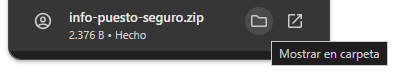
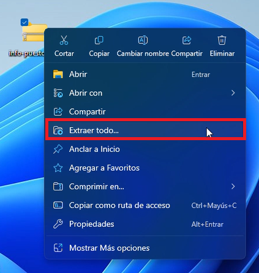
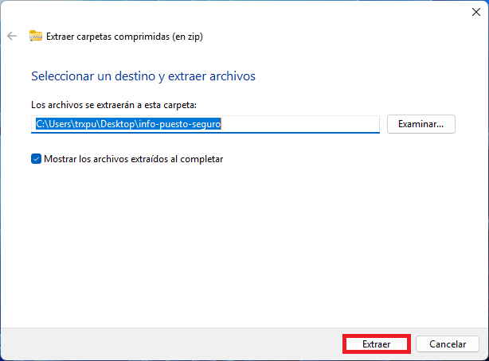
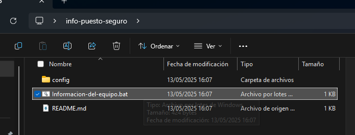
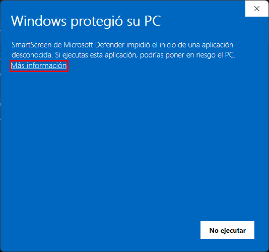
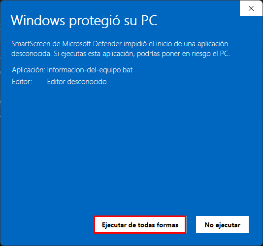
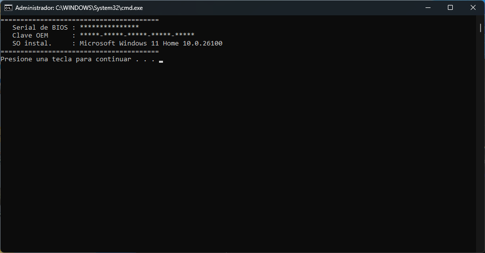

# 📥 Guía rápida para utilizar la herramienta

Sigue estos pasos sencillos para descargar, ejecutar y enviar la información de tu equipo.

## Paso 1: Descargar y extraer

1. Haz clic en el botón **Descargar ZIP** para iniciar la descarga.

    

2. Cuando termine la descarga, localiza el archivo `Información-del-equipo.zip` en tu carpeta de descargas.

    

3. Puedes mover el **archivo ZIP** al `Escritorio`

    

4. Haz clic derecho sobre el ZIP y selecciona **Extraer todo...**.

    

    

## Paso 2: Ejecutar la herramienta

1. En la carpeta extraída, localiza el archivo `Informacion-del-equipo.bat`.

    

2. Haz doble clic en él.

3. Si aparece un aviso de seguridad o UAC, selecciona **Más información** y después **Ejecutar de todos modos**.

    

    

## Paso 3: Ver los datos del equipo

1. Se abrirán varias ventanas de consola y se mostrarán:
   * Serial de BIOS
   * Clave OEM
   * Versión de Windows

2. Asegúrate de que la ventana muestre todos los datos de forma completa.

    

## Paso 4: Tomar la foto y enviar

> 🔒 Trata la foto con confidencialidad y envíala solo por el formulario indicado

1. Con tu móvil o cámara, haz una **foto** de la pantalla asegurándote de que se vea la ventana completa con los datos.

2. Abre el formulario de Google en el siguiente enlace y rellena los campos:

    
   
   👉 [Formulario para enviar la foto](https://forms.gle/JxxWWzCNE8BLf5tP7)

3. Rellena el formulario adjunta la foto y pulsa **Enviar**.

---

## Soporte y dudas

Si encuentras algún problema en cualquier paso, contacta con el equipo de TI responsable de la herramienta.

### Cubetic Consultores

* 📞 953 79 19 88
* 📩 [info@cubetic.com](mailto:info@cubetic.com)
